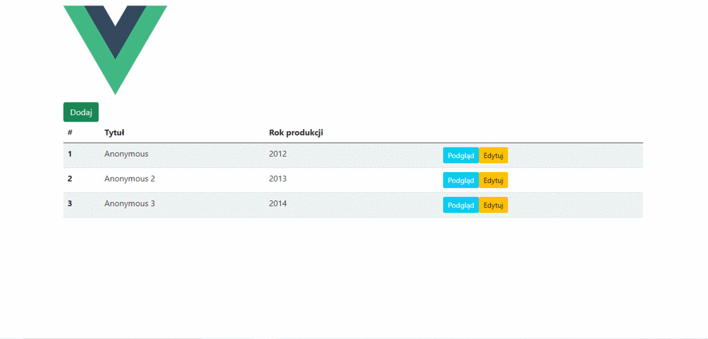

# MyVideos_AspNetCore_Vue

This is a simple SPA(Single Page Application) with use ASP.Net Core and Vue.js. The application run ASP.NET  5.0 with MSSQL database and Vue CLI. 

## Demo 


## Run the application
1. Complet ConnectionStrings in appsettings.json
```
  "ConnectionStrings": {
    "VideoDB": "(your connection strings)"
  },
```
2. Migrations and update database
```
dotnet ef migrations add VideoDB
dotnet ef database update
```
3. Run the application
- Run the application in Visual Studio 2019 by hitting F5 
> if this is first running you must take a wait to download all client side dependencies

## Technologies
**ASP.Net 5.0**
* EntityFrameworkCore 
* VueCliMiddlewar to integrate with 'ClientApp'

**Vue.js with Vue CLI 4.5**
* axios
* bootstrap
* vuex
* vuelidate
* ...

## License

[](https://mit-license.org/)